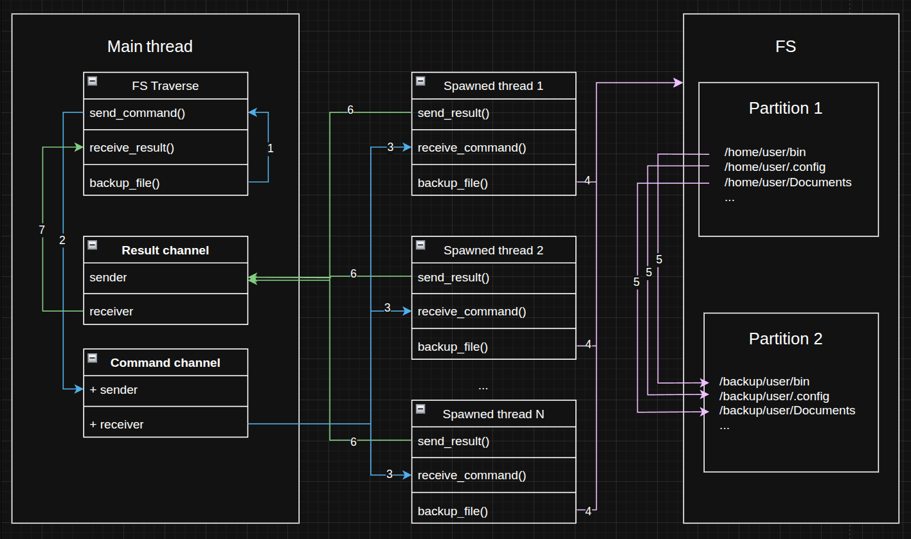

<div align="center">
  <h1><code>simple-files-backup</code></h1><sub>Built with 🦀</sub>
</div>

[](https://github.com/arthurhovhannisyan31/simple-files-backup/actions/workflows/code-validation.yml)

## Overview

This is a CLI tool for backing up files, directories and symlinks.

Compatible with `Linux`, `Windows`, `Mac`.

## Synopsis

- `-c, --config <CONFIG>`
- `-h, --help`  Print help
- `-V, --version`  Print version

## Description

Copies list of source files/directories to back-up folder in multithreaded mode.

The backup operations are distributed between several system threads.
Main thread does fs traversal, sends backup commands and logs results.
Spawned threads receive backup commands, copy files and submit results.
Communication between threads based on [MPSC](https://doc.rust-lang.org/std/sync/mpsc/index.html) channels which allows
threads receive commands in order, excluding job duplication.



## Usage

Copy the binary from the `bin` folder.
Make sure the binary has sufficient rights to make directories manipulations.

Add a json config with the following format:

```
ignore?: String,
source: Array<String>,
target: String
log?: String
```

The `source` and `target` paths should be existing absolute files/directories paths. Ignore is a regex string which
includes
filename and directory name patterns to skip. Each run logs statistics to the `log` file, or creates one if missing.

Config example:

```
"ignore": "/(node_modules|.yarn|.next|target|yarn.lock)",
"source": [
    "/home/<user>/.config",
    "/home/<user>/Documents"
],
"target": "/data/backup",
"log": "/home/<user>/log"
```

```shell
    simple-files-backup -c ./config.json
```

## Stack

- Rust
- Chrono
- Clap
- Regex
- Serde

## License

Licensed under either of at your option.

* Apache License, Version 2.0, [LICENSE-APACHE](./LICENSE-APACHE) or http://www.apache.org/licenses/LICENSE-2.0
* MIT license [LICENSE-MIT](./LICENSE-MIT) or http://opensource.org/licenses/MIT
